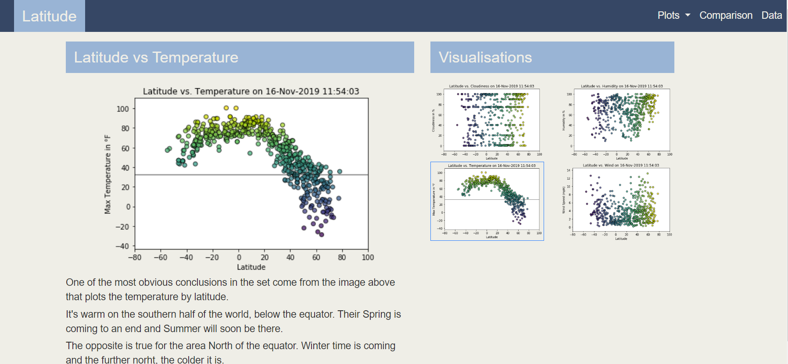
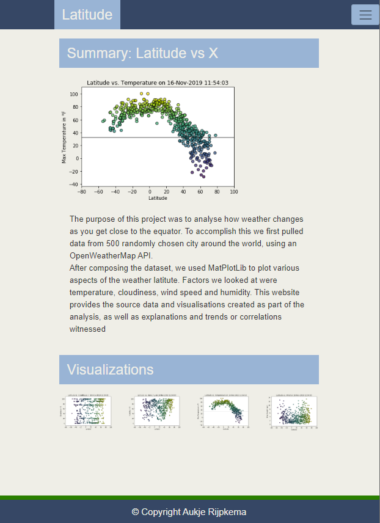

Week 11: Web Design Challenge

For this challenge we were asked to develop a 7 page website using the graphs and conclusions from week 6.
Using 4 images displaying world wide weather data (500 randomly chosen cities) Temperatures, Wind speed, Humidity and Cloudiness were plotted by latitude. The page was to be interactive and able to run on large and small screens.

PLEASE USE MY GITHUB WEBPAGE TO ENTER THE WEBSITE CREATE!

Some of the output produced:

On a large screen:

 

On a small screen:

 